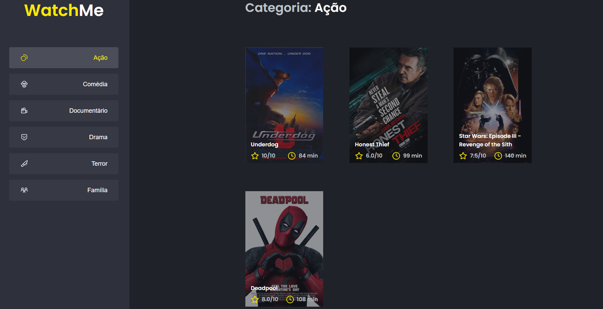

# Desafio 02 Trilha React - WatchMe

<p>Resoluçãoo do Desafio 02 da trilha de React do Ignite - Rocketseat</p>

<p>Tecnologias utilizadas: React, JSON Server, Yarn. </p>

## Como usar? ##

 <div align="center">
  
 </div>

  &#xa0;

</div>

<p align="center">
  <a href="#dart-sobre">Sobre</a> &#xa0; | &#xa0;
  <a href="#rocket-tecnologias">Tecnologias</a> &#xa0; | &#xa0;
  <a href="#white_check_mark-pré-requesitos">Pré-requisitos</a> &#xa0; | &#xa0;
  <a href="#checkered_flag-começando">Iniciando</a> &#xa0; | &#xa0;
  <a href="#memo-licença">Licença</a> &#xa0; | &#xa0;
</p>

<br>

## :dart: Sobre ##

WatchMe é uma aplicação de lista de filmes, divididos por gênero.

## :rocket: Tecnologias ##

As seguintes ferramentas foram usadas na construção do projeto:

- [React](https://pt-br.reactjs.org/)
- [Yarn](https://yarnpkg.com/)
- [JSON Server](https://www.npmjs.com/package/json-server)

## :white_check_mark: Pré-requisitos ##

Antes de começar :checkered_flag:, você precisa ter o [Git](https://git-scm.com) e o [Node](https://nodejs.org/en/) instalados no PC!

## :checkered_flag: Iniciando ##

```bash
# Clone este repositório
$ git clone https://github.com/mesquini/watchme

# Entre na pasta
$ cd watchme

# Instale as dependências
$ yarn

# Para iniciar json-server
$ yarn server

# Para iniciar o projeto
$ yarn dev
```

## :memo: Licença ##

Este projeto está sob licença MIT. Veja o arquivo [LICENSE](license.md) para mais detalhes.

&#xa0;

<a href="#top">Voltar para o topo</a>

---

<p align="center">
  Made with 💜&nbsp; by <a href="https://www.linkedin.com/in/mesquini/">Victor Mesquini</a>
</p>
